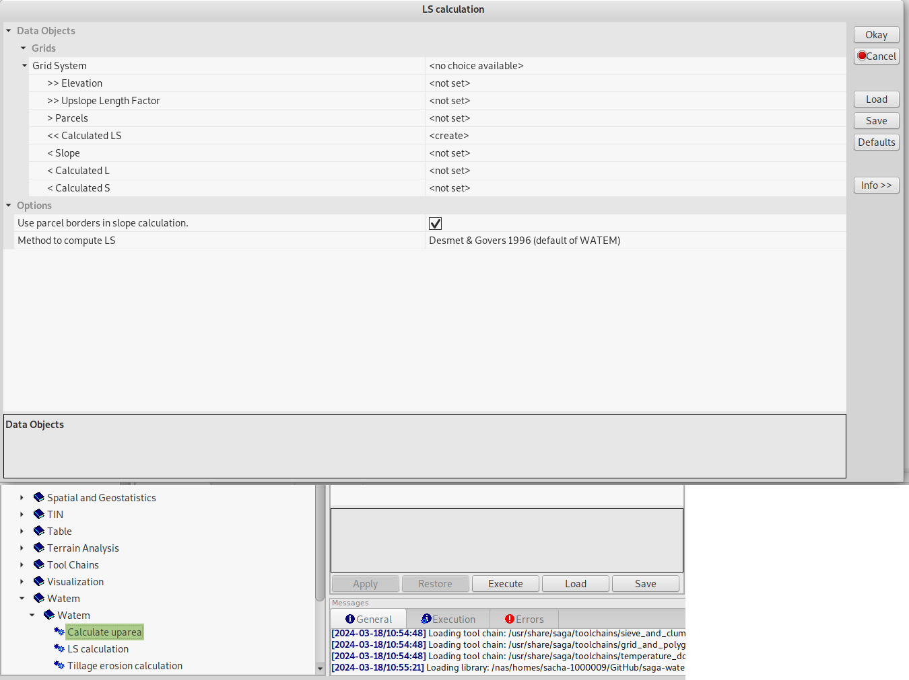
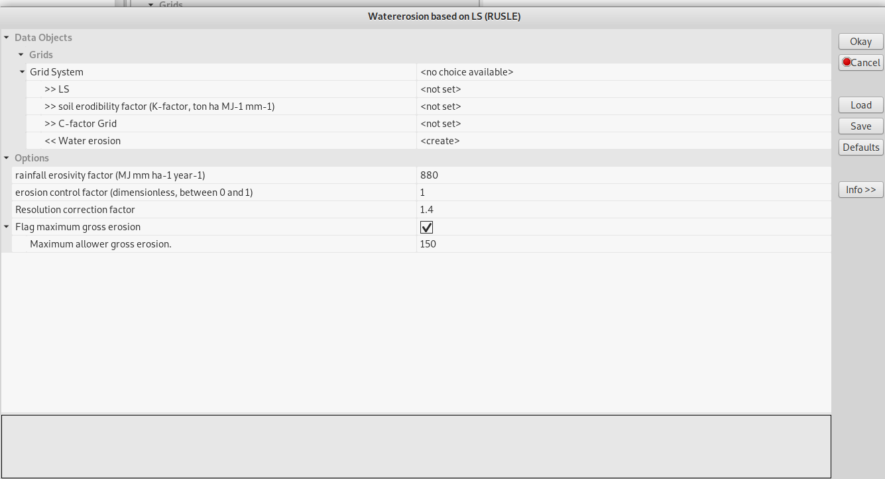
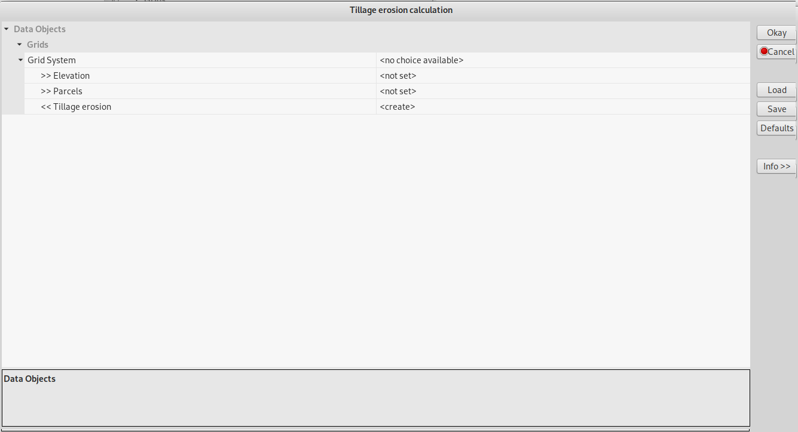

(gettingstarted)=

# Getting started

The current module contains a number of tools to compute the **erosion map**.
The available tools can be categorized in three categories:

1. Core functionalities to compute the erosion map with WaTEM. 
2. Extra tools to prepare input data for core computations.
3. Topology-tooling: used to topologize river networks (not used in the 
   Flanders application).

The main aim of this page is to illustrate with the SAGA-GUI how the erosion
map can be computed.  It is important to note that the extra tooling was 
developed to process input data available in Flanders 
(see [Application to Flanders](flanders-tool.md)).  

The information for the tolopogy-tool is found [here](topology.md)

## The WaTEM module

In SAGA GIS, all modules can be called from the "Geoprocessing" menu, in the 
'Watem' submenu, holding core functionalities:

*Figure 1: Calling the WaTEM (core) module from the menu*

And functionalities specific to Flanders:

*Figure 2: Calling the WaTEM (flanders) module from the menu*

It is also possible to launch the same modules from the tools tab in the 
"manager" window. The description tab then also displays the module's 
documentation.

*Figure 3: Calling up the WaTEM module via the "manager" window*

The import grids are displayed in the interface with ">>" This means that they
are mandatory for import. Output grids (or shapefiles) start by default with 
"<<" for mandatory output and "<" for optional output.

## Compute water erosion
A short introduction to the tools is given. For a detailed overview on the 
inputs, outputs and options, we refer to the module reference).

- Calculation of the upslope area (tool 'watem-1', used to be module 3.1, 
  see legacy). You need to define a digital elevation model, parcels rasters. 
  You will obtain a pits (unique id per pit) anbd upslope area raster (see 
  Figure 3)

- LS Calculation (tool 'watem-2', used to be module 3.2, 
  see legacy). Different definitions can be used.

*Figure 4: LS calculation*

- Water erosion calculation based on LS (tool 'watem-4', used to be module 3.4, 
  see legacy). Note that a LS-, C- and K-grid needs to defined. Otherwise R-
  and P-factor need to be defined as numbers (floats).

*Figure 5: Water erosion calculation based on LS*

- Treatment erosion calculation (tool 'watem-3', used to be module 3.5, 
  see legacy). Tillage erosion is not included in the annual Potential soil 
  erosion map per plot.

*Figure 7: Module 3.5. Tillage erosion calculation*