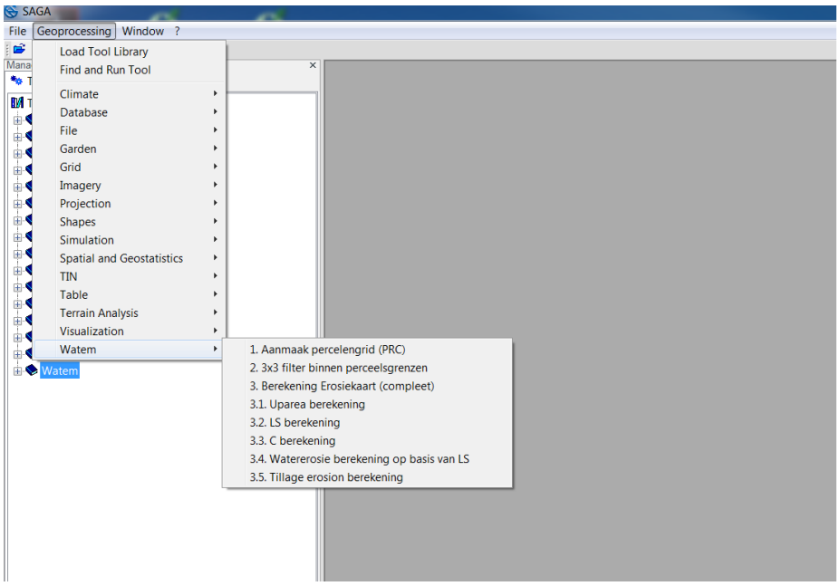
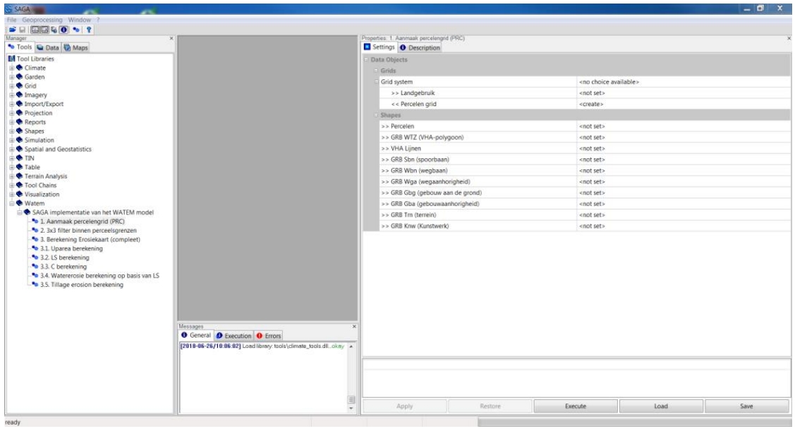
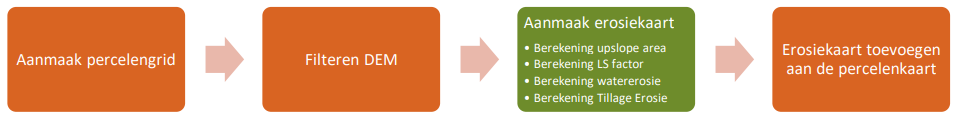
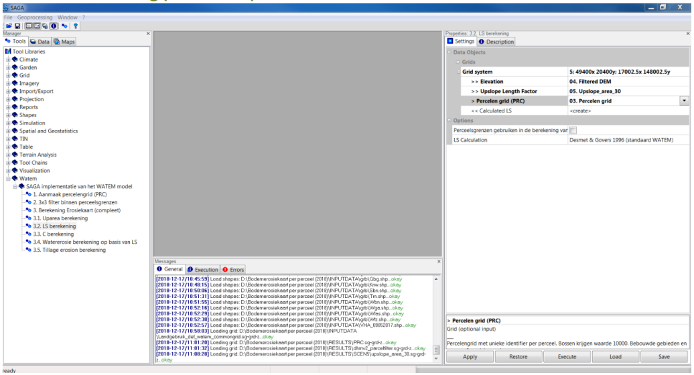
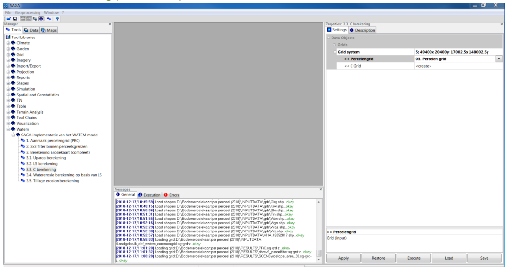
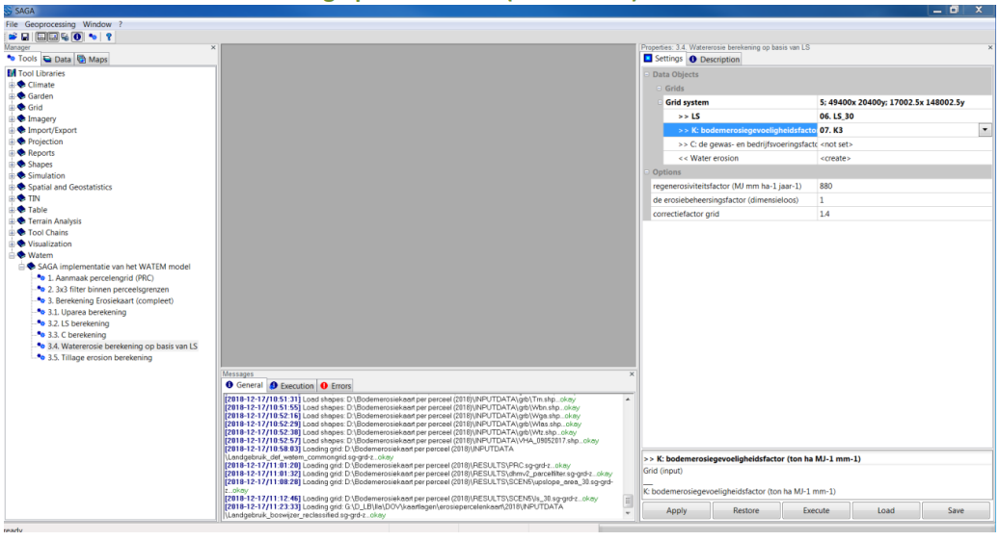

(gettingstarted)=

# Getting started

The current module contains a number of tools to compute the **erosion map**.
The available tools can be categorized in three categories:

1. Core functionalities to compute the erosion map with WaTEM. 
2. Extra tools to prepare input data for core computations.
3. Topology-tooling: used to topologize river networks.

It is important to note that the extra tooling was developed to process 
input data available in Flanders (see [Application to Flanders](flanders-tool.md))

The information for the tolopogy-tool is found [here](topology.md)

## The WaTEM module

In SAGA GIS, all modules can be called from the "Geoprocessing" menu, in the 
'Watem' submenu.

*Figure 7: Calling the WaTEM module from the menu*

It is also possible to launch the same modules from the tools tab in the 
"manager" window. The description tab then also displays the module's 
documentation.

*Figure 8: Calling up the WaTEM module via the "manager" window*

The import grids are displayed in the interface with ">>" This means that they
are mandatory for import. Output grids (or shapefiles) start by default with 
"<<" for mandatory output and "<" for optional output.

## Compute water erosion

*Figure 9: The process of calculating an erosion map, the creation of an 
erosion map (in Dutch)*

The calculation of water erosion can be done in several steps (different 
tools 3.1, 3.2, 3.3, 3.4 and 3.5) or in 1 step with the tool 
'3. Calculation Erosion Map (complete)'. This tool performs all the steps 
below in 1 run.

- Calculation of the upslope area (module 3.1) #TODO

*Figure 10: Module 3.1. Uparea calculation*

- LS Calculation (module 3.2) #TODO

*Figure 11: Module 3.2. LS calculation*

- C calculation (Module 3.3) #TODO

*Figure 12: Module 3.3. C calculation*

- Water erosion calculation based on LS (module 3.4) #TODO

*Figure 13: Module 3.4. Water erosion calculation based on LS*

- Treatment erosion calculation (module 3.5) #TODO

Tillage erosion is not included in the annual Potential soil erosion map per plot.

*Figure 14: Module 3.5. Tillage erosion calculation*

There is also a single tool that can be used to compute the erosion map with 
one command  

*Figure 15: Module 3. Erosion map calculation (complete).*

Initially, under "Grid system" you need to select the correct system. Then the 
other grids can be selected. In this module, the machining erosion can 
optionally also be calculated. If no value is given here, this calculation 
will not be performed.