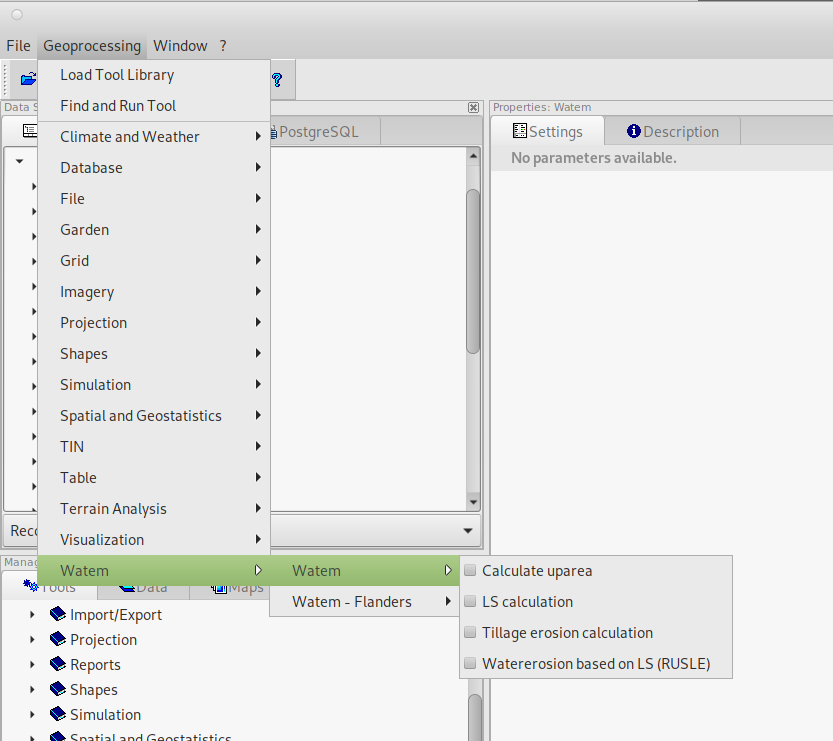
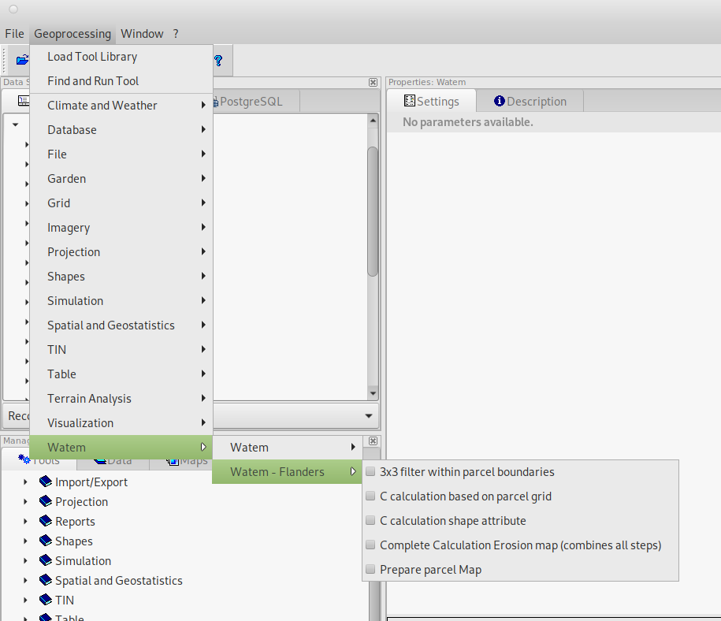
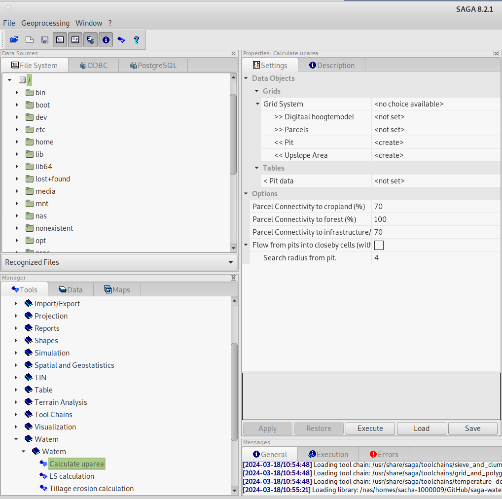

(gettingstarted)=

# Getting started

The current module contains a number of tools to compute an erosion map.
The available tools can be categorized in three submodules:

1. Core Functionalities: for the computation of the erosion map with WaTEM 
2. Flanders Functionalities: for the preparation of input data as used in 
   Flanders. Note that we sometimes refer to this as 'extra' or 'additional' 
   tooling.
3. Topology Tooling: for creating river network topologies (used in 
   WaTEM/SEDEM)

The main aim of this page is to illustrate how the erosion
map can be computed.  It is important to note that the extra tooling was 
developed to process input data available in Flanders 
(see [Application to Flanders](flanders-tool.md)). 

## The WaTEM module

The WaTEM module can be run in the command line or it can be used in the SAGA
GUI. For the GUI, one can find all modules in the 
"Geoprocessing" menu, in the 'Watem' submenu, holding core functionalities 
(check the [Installation page](installation.md)).


*Figure 1: Calling the WaTEM (core) module from the menu*

And functionalities specific to Flanders (for further information see 
[here](flanders-tool.md)):


*Figure 2: Calling the WaTEM (flanders) module from the menu*

It is also possible to launch the same modules from the tools tab in the 
"manager" window. The description tab then also displays the module's 
documentation.


*Figure 3: Calling up the WaTEM module via the "manager" window*

The import grids are displayed in the interface with ">>" This means that they
are mandatory for import. Output grids (or shapefiles) start by default with 
"<<" for mandatory output and "<" for optional output.

The WaTEM/SAGA module can also be run in the command line, similar to SAGA:

```shell
saga_cmd watem 1 ...
```

For running WaTEM (four tools in total)

```shell
saga_cmd watem_flanders 1 ... 
```

For running application Flanders (five tools in total). 

An example of a running a tool in cmd is given below:

```shell
saga_cmd watem-1 -DEM %YOUR_DEM_INPUT -PRC %YOUR_PARCEL_INPUT 
-PIT %YOUR_PIT_OUTPUT -UPSLOPE_AREA %YOUR_UPSLOPE_OUTPUT -PITDATA
%YOUR_PIT_TABLE_OUTPUT
```

The ``%YOUR_...`` are references to saga grids or files. Consult the 
[model reference](overview_watem) for additional instructions.

## Compute water erosion

A short introduction to the tools is given. For a detailed overview on the 
inputs, outputs and options, we refer to the 
[module reference](overview_watem). The computation works in the consequential 
use of different tools:

1. Compute the uparea (tool 'watem-1', used to be module 3.1, 
   see legacy). You need to define a digital elevation model and a parcels
   rasters. You will obtain a pits raster and table (unique id per pit) and
   upslope area raster. One can adjust the parameters 'connectivities' and 
   'search radius from pit' parameters. The pits can be used to analyse 
   filling pattern.
2. The output from the uparea tool is used as an input for the LS 
   Calculation (tool 'watem-2', used to be module 3.2, 
   see legacy). A DTM and the computed uparea from step one are needed as 
   input. An optional input 'parcels' can be used: this input is used when one 
   wants to do the slope calculations within parcel boundaries (see 
   'Use parcel borders in slope calculation' parameter). Different 
   formulations to compute the LS-factor can be used (see also the 
   [model description](description.md))
3. Water erosion calculation based on LS (tool 'watem-4', used to be module 3.4, 
   see legacy). Note that an LS-, C- ([0,1]) and K-grid 
   ($\frac{\text{kg.h}}{\text{MJ.mm}}$) to be defined. R- 
   ($\frac{\text{MJ.mm}}{\text{ha.h.year}}$) and P-factor ([0,1]) need to be defined as 
   numbers (floats). Note that a maximum gross erosion can be defined as an
   upper boundary condition. In addition, a resolution correction factor can be 
   defined, this is a value with which  the RUSLE value is divided 
   (for the [flanders application](flanders-tool.md), this is 1.4).

The format for the parcel map is (see also in 
[module reference](overview_watem)):

- a unique identifier per parcel: [1,9999]
- Forest = 10000
- Infrastructure & roads = -2
- Water (river/open water) -1


## Compute tillage erosion

The tillage erosion calculations can be done with the tool 'watem-3' (prior 
module 3.5, see legacy). The input fo this module is a parcel grid and a 
digital elevation model. The *ktil* parameter is hardcoded as 600 kg/m
